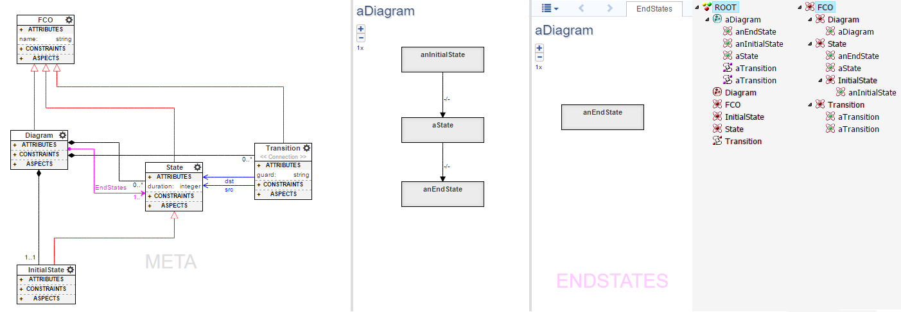
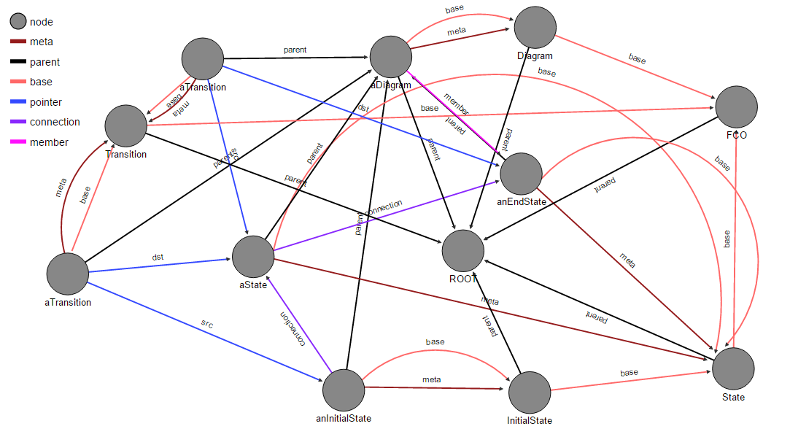

# Graph-Queries
Tools for mapping a webgme project into a graph-database (currently orientDB). 

### Mapping example

#### Example project in webgme
From left to right: Meta-Model, Composition (of "aDiagram"), Set-Editor (of "aDiagram"), Composition-Tree, Inheritance-Tree.

#### Example project as mapped to graphDB
Meta nodes has a "meta" relation to themselves (not visualized in graph).

### Developer
On ubuntu 16.4
#### Initial Setup

Additional dependencies (above node/nvm, git and mongodb).
 - redis running on port 6379, using docker `sudo docker run -p 6379:6379 --name some-redis -d redis`
 - haproxy [instruction on how to use apt-get](https://www.upcloud.com/support/haproxy-load-balancer-ubuntu/)

Configuration for haproxy:
 - `sudo cp haproxy.cfg /etc/haproxy/haproxy.cfg`
 - `sudo systemctl --system restart haproxy.service`

Make sure to have to repositories checked out (edit path in services if needed).

Double check that blob-local-storage exists as defined in `config/config.multi.js`.

 - `sudo cp webgme1.service /lib/systemd/webgme1.service`
 - `sudo cp webgme2.service /lib/systemd/webgme2.service`
 - `sudo cp webgme_addon.service /lib/systemd/webgme_addon.service`

Reload the daemon
`sudo systemctl --system daemon-reload`

#### Starting/Restarting Webgme Services
 - `sudo systemctl --system start webgme1.service`
 - `sudo systemctl --system start webgme2.service`
 - `sudo systemctl --system start webgme_addon.service`

 - `sudo systemctl --system stop webgme1.service`
 - `sudo systemctl --system restart webgme1.service`
 - `sudo systemctl --system status webgme1.service`

